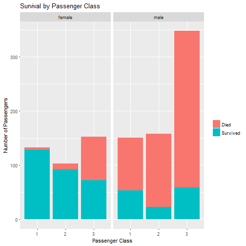
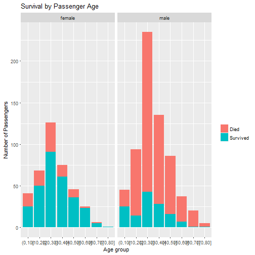

Developing Data Products Course Project
========================================================
author: ayloginov
date: 30 October 2017
autosize: true

Introduction
========================================================

This presentation introduces the Shiny app developed as part of the Developing Data Products course project.

The app illustrates the influence of different parameters, such as gender, age, passenger class, etc. on the chance of survival for Titanic passengers.

The app allows to:

- Input parameters for a hypothetic Titanic passenger
- Predict survival of such passenger using logistic regression model


Link to the app <https://ayloginov.shinyapps.io/dp_project_app/>


The Dataset
========================================================

The app uses the "Titanic3" dataset from the Biostatistics Department of the Vanderbilt University. 

The data can be downloaded from the following page (scroll down for "Data for Titanic passengers" and choose the preferred file format):
<http://biostat.mc.vanderbilt.edu/wiki/Main/DataSets>

The description of the dataset can be found here:
<http://biostat.mc.vanderbilt.edu/wiki/pub/Main/DataSets/titanic3info.txt>


Overview of Titanic survival patterns
========================================================





The Model
========================================================

The model uses logistic regression to predict passenger survival based on the following variables: sex, pclass, siblsp, parch, age, age squared, fare, fare squared (see dataset description for detailed information about the variables). The accuracy of the model is 80.4%  

The R code for the model (fragments):

```r
model_logit <- glm(data = t, survived ~ ., family = binomial(link = "logit"), x = TRUE)

output$pred1 <- renderText({
        if(plogis(model_logitpred()) < 0.6) {"Predicted to die"}
        else {"Predicted to survive"}
```
